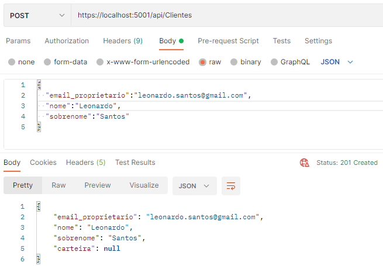
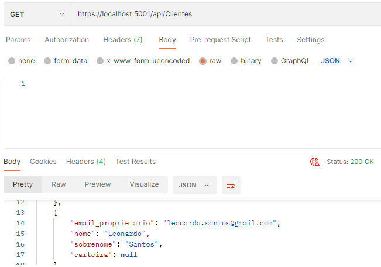
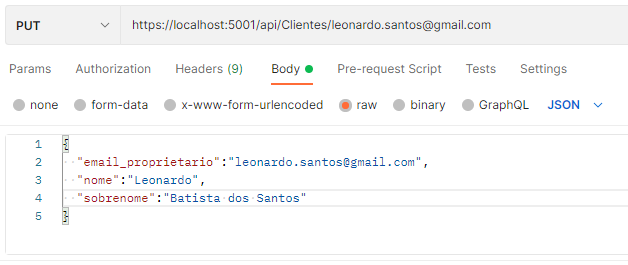
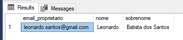
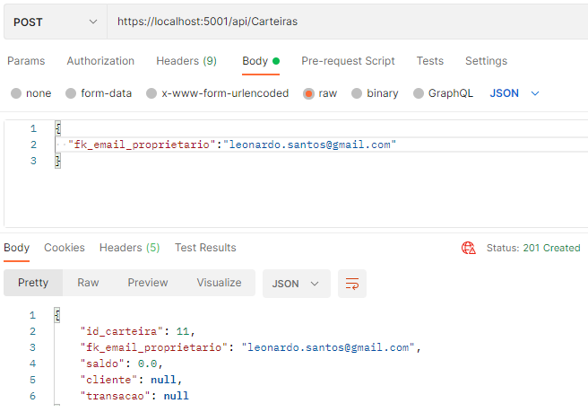
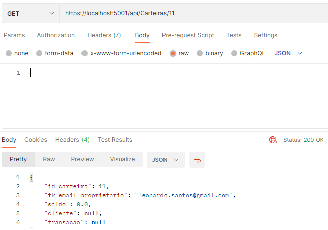
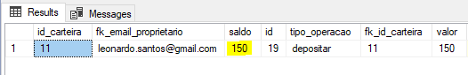
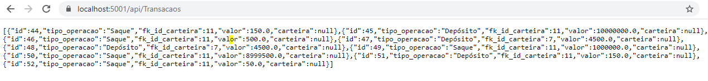

# CashBank
Cadastro e gerenciamento de carteiras digitais

O CASHBANK é uma API .NET CORE que permite o gerenciamento de uma carteira digital. Cada cliente pode ter apenas uma carteira. A carteira possui apenas duas operações: Depositar e Sacar.

# Primeiros passos

O código disponível neste repositório contém apenas a API. Portanto, usaremos o POSTMAN para testar os recursos disponíveis. A STRING de conexão do banco de dados foi omitida. Logo, será necessário criar um banco de dados. Exemplo:

•	Abra o SQL Server;
•	Clique com o botão direito em cima de DATABASE;
•	Selecione New DATABASE;
•	Copie a STRING de conexão;
•	Cole-a no local indicado do arquivo appsettings.json;
•	Execute as MIGRATIONS;
Após as migrações, adicione o trigger à tabela “Transacao”:

```
CREATE trigger Ajusta_Saldo_Deposito
ON Transacao
FOR INSERT
AS
BEGIN 
	DECLARE 
		@fk_id_carteira int,
		@valor int,
		@tipo_operacao varchar(100)
	SELECT	
		@fk_id_carteira = fk_id_carteira, 
		@valor = valor,
		@tipo_operacao = tipo_operacao
	FROM 
		INSERTED
	update Carteira set saldo = (select top (1) case when (saldo + valor)>= 0 then (saldo + valor) else saldo end from Carteira c join Transacao t on c.id_carteira = t.fk_id_carteira where id_carteira = @fk_id_carteira order by id DESC) where id_carteira = @fk_id_carteira and @tipo_operacao = 'Depósito'; 
END
GO

CREATE trigger Ajusta_Saldo_Saque
ON Transacao
FOR INSERT
AS
BEGIN 
	DECLARE 
		@fk_id_carteira int,
		@valor int,
		@tipo_operacao varchar(100)
	SELECT	
		@fk_id_carteira = fk_id_carteira, 
		@valor = valor,
		@tipo_operacao = tipo_operacao
	FROM 
		INSERTED
	update Carteira set saldo = (select top (1) case when (saldo - valor)>= 0 then (saldo - valor) else saldo end from Carteira c join Transacao t on c.id_carteira = t.fk_id_carteira where id_carteira = @fk_id_carteira order by id DESC) where id_carteira = @fk_id_carteira and @tipo_operacao = 'Saque'; 
END
GO
```
# Gerenciando uma carteira

Antes de tudo, precisamos cadastrar um cliente. Para isso, acessaremos o POSTMAN e criaremos uma HTTP REQUEST. Selecionando o verbo POST utilize a URL: https://localhost:5001/api/Clientes. Então, clique em BODY, RAW  e selecione JSON. Este é um exemplo para o cadastro:

```
{
  "email_proprietario":"leonardo.santos@gmail.com",
  "nome":"Leonardo",
  "sobrenome":"Santos"
}
```



Acessamos uma lista de clientes cadastrados alternando para o verbo GET:



Para atualizar um cadastro selecionamos o verbo PUT usando a URL: https://localhost:5001/api/Clientes/email_do_cliente_cadastrado. 





Com o cliente cadastrado, podemos criar uma carteira. Com o verbo POST, insira a URL: https://localhost:5001/api/Carteiras. Exemplo para cadastrar uma carteira:

```
{
  "fk_email_proprietario":"Leonardo.santos@gmail.com"
}
```



Podemos consultar a carteira de um cliente a partir de seu ID com a URL: https://localhost:5001/api/Carteiras/id_carteira.



Com a carteira cadastrada, depositamos e sacamos valores dela através da URL: https://localhost:5001/api/Transacaos. Um exemplo de transação:
```
{
  "tipo_operacao":"depositar",
  "fk_id_carteira":"11",
  "valor":"150"
}
```



Para listar todas as transações feitas pelo CASHBANK selecionamos o verbo GET e usamos a URL: https://localhost:5001/api/Transacaos. 


