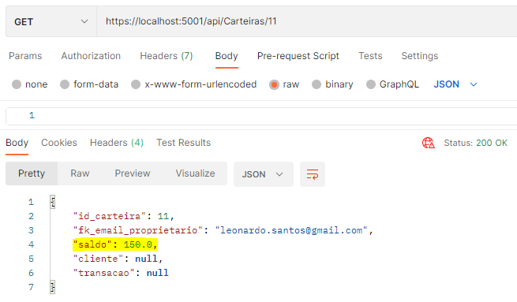
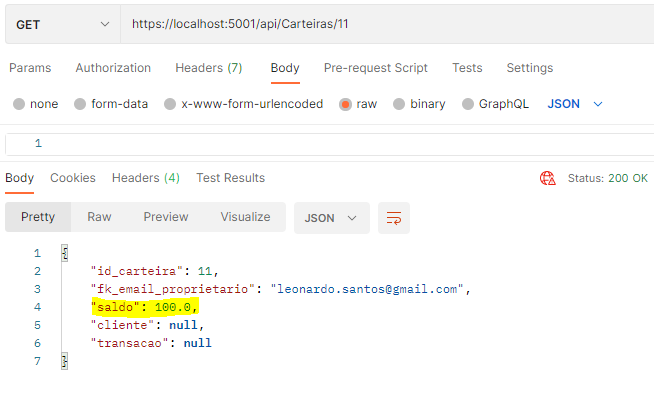
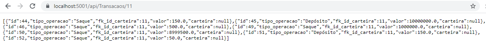

# CashBank
### Cadastro e Gerenciamento de Carteiras Digitais

O CashBank é uma **API .NET CORE** que permite o gerenciamento de uma carteira digital. Cada cliente pode ter apenas uma carteira. A carteira possui apenas duas operações: Depositar e Sacar.

## Primeiros passos

O código disponível neste repositório contém apenas a API. Portanto, usaremos o **POSTMAN** para testar os recursos disponíveis. A string de conexão do banco de dados foi omitida. Logo, será necessário criar um banco de dados antes de iniciar os testes. Exemplo:

•	Abra o SQL Server;

•	Clique com o botão direito em cima de DATABASE;

•	Selecione New DATABASE;

•	Copie a STRING de conexão;

•	Cole-a no local indicado do arquivo appsettings.json;

•	Execute as MIGRATIONS;

Após as migrações, adicione os triggers à tabela “Transacao”:

```
CREATE TRIGGER Ajusta_Saldo_Deposito
ON Transacao
FOR INSERT
AS
BEGIN 
	DECLARE 
		@fk_id_carteira INT,
		@valor INT,
		@tipo_operacao VARCHAR(100)
	SELECT	
		@fk_id_carteira = fk_id_carteira, 
		@valor = valor,
		@tipo_operacao = tipo_operacao
	FROM 
		INSERTED
	UPDATE Carteira SET saldo = (SELECT TOP (1) CASE WHEN (saldo + valor)>= 0 THEN (saldo + valor) ELSE saldo END FROM Carteira c JOIN Transacao t ON c.id_carteira = t.fk_id_carteira WHERE id_carteira = @fk_id_carteira ORDER BY id DESC) WHERE id_carteira = @fk_id_carteira AND @tipo_operacao = 'Depósito'; 
END
GO

CREATE TRIGGER Ajusta_Saldo_Saque
ON Transacao
FOR INSERT
AS
BEGIN 
	DECLARE 
		@fk_id_carteira INT,
		@valor INT,
		@tipo_operacao VARCHAR(100)
	SELECT	
		@fk_id_carteira = fk_id_carteira, 
		@valor = valor,
		@tipo_operacao = tipo_operacao
	FROM 
		INSERTED
	UPDATE Carteira SET saldo = (SELECT TOP (1) CASE WHEN (saldo - valor)>= 0 THEN (saldo - valor) ELSE saldo END FROM Carteira c JOIN Transacao t ON c.id_carteira = t.fk_id_carteira WHERE id_carteira = @fk_id_carteira ORDER BY id DESC) WHERE id_carteira = @fk_id_carteira AND @tipo_operacao = 'Saque'; 
END
GO
```
## Gerenciando uma carteira

Antes de tudo, precisamos cadastrar um cliente. Para isso, acessamos o POSTMAN e criamos uma HTTP REQUEST. Selecionando o verbo POST utilize a URL: https://localhost:5001/api/Clientes. Então, clique em BODY, RAW  e selecione JSON. Este é um exemplo para o cadastro:

```
{
  "email_proprietario":"leonardo.santos@gmail.com",
  "nome":"Leonardo",
  "sobrenome":"Santos"
}
```


Acessamos uma lista de clientes cadastrados alternando para o verbo GET:


Para atualizar um cadastro selecionamos o verbo PUT usando a URL: https://localhost:5001/api/Clientes/email_do_cliente_cadastrado. 


Com o cliente cadastrado, podemos criar uma carteira. Com o verbo POST, insira a URL: https://localhost:5001/api/Carteiras. Exemplo para cadastrar uma carteira:

```
{
  "fk_email_proprietario":"Leonardo.santos@gmail.com"
}
```


Podemos consultar a carteira de um cliente a partir de seu ID com a URL: https://localhost:5001/api/Carteiras/id_carteira.


Com a carteira cadastrada, depositamos e sacamos valores dela através da URL: https://localhost:5001/api/Transacaos. Exemplo de um depósito:
```
{
  "tipo_operacao":"Depósito",
  "fk_id_carteira":"11",
  "valor":"150"
}
```



Para sacar valores da carteira, usamos a mesma rota. Entretanto, devemos alternar para o verbo DELETE. Exemplo de um saque:

```
{
  "tipo_operacao":"Saque",
  "fk_id_carteira":"11",
  "valor":"50"
}
```


**OBS: O valor do campo tipo_operacao deve ser "Saque" (para sacar) e "Depósito" (para depositar).**  

Para listar todas as transações feitas pelo CASHBANK selecionamos o verbo GET e usamos a URL: https://localhost:5001/api/Transacaos. 


Para listar todas as transações feitas por uma determinada carteira usamos a URL: https://localhost:5001/api/Transacaos/id_da_carteira_do_cliente.


